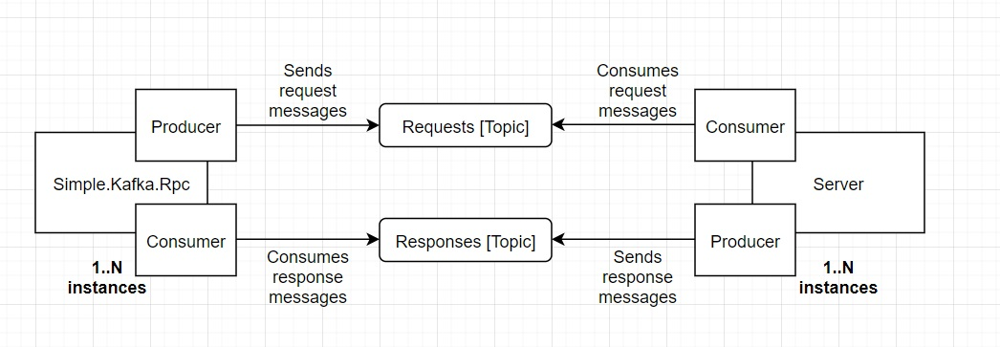

## NuGet 
[Simple.Kafka.Rpc](https://www.nuget.org/packages/Simple.Kafka.Rpc/)

Version mapping between [Simple.Kafka.Rpc](https://www.nuget.org/packages/Simple.Kafka.Rpc/) and [Confluent.Kafka](https://www.nuget.org/packages/Confluent.Kafka/):
1. 1.0.0 -> 1.0.0
2. 1.5.0+ -> 1.5.0+
3. 1.6.0 -> 1.6.0+
4. 1.7.0+ -> 1.7.0+
5. 1.8.0+ -> 1.8.0+ (latest)

## Table of contents
1. [Introduction](#1-introduction)
2. [Advantages and disadvantages](#2-advantages-and-disadvantages)
3. [Examples](#3-examples)
4. [Healthcheck](#4-healthcheck)
5. [Builder](#5-builder-api)
6. [RpcClient](#6-rpcclient-api)
7. [Configuration](#7-configuration)

# 1. Introduction

`Simple.Kafka.Rpc` allows you to use Kafka not only as commit log but also for `Request/Response` type of communication between microservices, for example. What does it mean?

Let's write an example of http call to google.com in `C#` which might look like this:

```csharp

// Disposing a client here for demonstration purposes
using var client = new HttpClient();

var response = await client.SendAsync(new HttpRequestMessage(HttpMethod.Get, "http://google.com"));
var content = await response.Content.ReadAsByteArrayAsync();

Console.WriteLine($"Content.Length is {content.Length}");

```

To make this work you need:
1. Client application that can send requests and receive responses using `HttpClient`
2. Server application that can parse requests, handle them and return responses (in our case - google servers)

For you `HttpClient` implementation is a blackbox - all you need is a working client and server.

Let's now check an API that Simple.Kafka.Rpc provides:

``` csharp

using var rpc = RpcClient.Create(b => 
{
    b.Config.Topics = new[] { "responses-topic" }; // Required
    b.Consumer.Kafka.BootstrapServers = "localhost:9092"; // Required
    b.Producer.Kafka.BootstrapServers = "localhost:9092"; // Required
});

var consumeResult = await rpc.SendAsync(new Message<byte[], byte[]>
{
    Key = Array.Empty<byte>(),
    Value = Array.Empty<byte>()
}, "requests-topic");

var content = consumeResult.Message.Value;
Console.WriteLine($"Content.Length is {content.Length}");

```

We can use `RpcClient` the same way we used `HttpClient` before.

To make this work you need:
1. Client application that can send request messages and recieve response messages using `RpcClient`
2. Server application that can parse requests and consume from Kafka topic and produce responses

For you `RpcClient` implementation is also a blackbox - all you need is a working client and server :)

As you can see there are a lots of similarities. `Simple.Kafka.Rpc`'s workflow can be demonstated using the diagram below:



`Simple.Kafka.Rpc` creates a consumer instance in background that is subscribed to responses topics provided in configuration and producer instance that produces messages when you call `Send` or `SendAsync`. `Simple.Kafka.Rpc` also checks that Kafka cluster is available, provides a healthcheck and is able to recreate consumer and producer instances transparently if it's possible.

Note that `Server` side should be implemented by yourself - you should create a consumer and producer and produce responses to corresponding topics in a manner that you wish to - in batches or one by one using `Confluent.Kafka`'s producer and consumer classes.

The question may arise - how `RpcClient` knows which response should be mapped to which request, well, `RpcClient` adds a special header to provided `Message<byte[], byte[]>` and you should populate it when you send a response. You can check how to propagate and extract it in an [examples](#3-examples) section.

# 2. Advantages and disadvantages

Let's start with advantages first:
1. Kafka has a high throughput so once implemented correctly 95th percentile can be really low for the whole flow - sending a request and receiving responses (depends on your use case and you can write load tests/benchmarks)
2. Library provides cluster failower discovery and can recreate producer/consumer instances
3. Health check is also available so if you use it in AspNetCore app you can restart your app in kubernetes if something goes wrong or remove it from load balancer, etc
4. Serializer/deserializer agnostic - library does not force you to use JSON/Protobuf/MessagePack/Avro etc, it's up to you, it does not modify bytes in a `Key` or `Value` - it only adds a header to your message
5. You can scale your server instances by changing number of partitions and use consumers with the same `GroupId`
6. You can also freely scale client instances - `Simple.Kafka.Rpc` uses `AutoOffsetReset.Latest` and random consumer group (which can be overriden) plus it never commits (can be changed to use `AutoCommits`)
7. Library does not enforces you to use specific Kafka client configuration - everything can be overriden

Disadvantages:
1. You should implement your own server instance that consumes/produces messages 
2. You can say that it's more complicated flow in terms of implementation
3. Relates to advantage (6) - if failover occurred and consumer instance is recreated - response is lost due to `AutoOffsetReset.Latest` so you should be aware that responses may be lost
4. Depending on your server implementation - requests can be lost too, but it's highly improbable using the same  `GroupId` and commiting once in a while using either `StoreOffset()` with `AutoCommitEnabled` or calling `Commit()` manually
5. You should be ready that requests can be retried by Kafka client

# 3. Examples

___

*Note:*

There is also an example of a todo list application (API) written using aspnet core which uses `Simple.Kafka.Rpc` client under the hood, sources:
1. [Todo list api](https://github.com/YeSv/Simple.Kafka.Rpc/blob/main/examples/Simple.Kafka.Rpc.Todo.Client)
2. [Backend](https://github.com/YeSv/Simple.Kafka.Rpc/blob/main/examples/Simple.Kafka.Rpc.Todo.Server)

___

In this section we are going to implement a primitive service-to-service communication with only one request and response contract. Client can issue a `Ping` requests and server returns `Pong` responses :)

Required steps:
1. Define request and response models
2. Define which serializer to use
3. Write a client
4. Write a server
5. Running kafka instance

Before we start, jfyi you can always check the source code for this section [here](https://github.com/YeSv/Simple.Kafka.Rpc/blob/main/examples/Simple.Kafka.Rpc.Readme).


First of all, we should define contracts (models), two structs with only one field of type `DateTime` should be enough:

``` csharp

    // Ping to a server
    [DataContract]
    public readonly struct Ping
    {
        public static readonly string Topic = "ping";

        [DataMember(Order = 0)] public readonly DateTime Time;

        public Ping(DateTime time) => Time = time;

        public static Ping New => new(DateTime.UtcNow);
    }

    // Response to corresponding ping 
    [DataContract]
    public readonly struct Pong
    {
        public static readonly string Topic = "pong";

        [DataMember(Order = 0)] public readonly DateTime Time;

        public Pong(DateTime time) => Time = time;

        public static Pong New => new(DateTime.UtcNow);
    }

```

As you can see we will send requests to `Ping.Topic` topic and recieve responses from `Pong.Topic` topic. Also our contracts only have one field for simplicity.

We are going to use [MessagePack](https://www.nuget.org/packages/MessagePack/) as serializer of choice but any other can do the trick, as it was mentioned previously, library does not enforce you to use any particular serializer.

To write client/server we only need two tasks - first one that will send requests and the second one that will consume requests and produce responses. For the sake of simplicity we will use a console application to emulate server and client.

Let's initialize rpc client (see the comments to understand what each line does):

```csharp

using var rpc = RpcClient.Create(b =>
{
    b.Config.Topics = new[] { Pong.Topic }; // Required

    // Here we specify logging for some useful events, you can skip it and those logs won't be printed 
    b.Consumer.RpcHandler.OnEof = consumeResult => Console.WriteLine($"[RPC] Got an EOF. TP: {consumeResult.TopicPartition}");
    b.Consumer.RpcHandler.OnRpcMessage = (header, result) => Console.WriteLine($"[RPC] Consumer received a response. Header: {header}. TPO: {result.TopicPartitionOffset}. Value len: {result.Message.Value.Length}");
    b.Consumer.RpcHandler.OnRpcLog = log => Console.WriteLine($"[RPC] Consumer log[{log.Level}] {log.Message}");

    // Consumer overrides:
    // All settings for consumer are available here: Consumer.Kafka (ConsumerConfig)
    b.Consumer.Kafka.BootstrapServers = "localhost:9092"; // Required

    // Consumer events: (all events are available here - like OnAssigned, OnRevoked, OnStatistics, etc.
    b.Consumer.KafkaHandler.OnAssigned = (c, assigned) => Console.WriteLine($"[RPC] Consumer partitions were assigned: {string.Join(",", assigned)}");

    // Producer config: (of type ProducerConfig)
    b.Producer.Kafka.BootstrapServers = "localhost:9092"; // Required

    // Kafka events like OnError, OnStatistics, etc
    b.Producer.KafkaHandler.OnError = (p, e) => Console.WriteLine($"[RPC] Producer error occurred: {e.Reason}");

    b.Producer.RpcHandler.OnRpcLog = log => Console.WriteLine($"[RPC] Producer log[{log.Level}] {log.Message}");
});

```

Let's also write an extensions so we don't have to provide topic name and value each time we call `SendAsync`:


```csharp

public static class PingPongRpcExtensions
{
    public static async Task<Pong> PingAsync(this IKafkaRpc rpc)
    {
        var consumeResult = await rpc.SendAsync(new Message<byte[], byte[]>
        {
            Key = Array.Empty<byte>(),
            Value = MessagePackSerializer.Serialize(Ping.New)
        }, Ping.Topic);

        return MessagePackSerializer.Deserialize<Pong>(consumeResult.Message.Value);
    }
}

```

We can now send a `Ping` request using just `rpc.PingAsync()` and recieve a `Pong` response.

Now it's time to add a client `Task` that will call our server with some interval:

``` csharp

using var stop = new CancellationTokenSource();

var clientTask = Task.Run(async () =>
{
    while (!stop.IsCancellationRequested)
    {
        var pong = await rpc.PingAsync();
        Console.WriteLine("Received pong response");

        await Task.Delay(5_000);
    }
}, stop.Token).ContinueWith(t => { });

```

We just send ping request once in 5 seconds until we decide to cancel `CancellationTokenSource` later in the code above.

Server `Task` code:

``` csharp

var serverTask = Task.Run(async () =>
{
    using var consumer = new ConsumerBuilder<byte[], byte[]>(new ConsumerConfig
    {
        AutoOffsetReset = AutoOffsetReset.Earliest,
        GroupId = Guid.NewGuid().ToString(),
        EnablePartitionEof = true,
        BootstrapServers = "localhost:9092",
        EnableAutoCommit = true,
        EnableAutoOffsetStore = true
    }).Build();

    using var producer = new ProducerBuilder<byte[], byte[]>(new ProducerConfig
    {
        BootstrapServers = "localhost:9092"
    }).Build();

    consumer.Subscribe(Ping.Topic);

    while (!stop.IsCancellationRequested)
    {
        var consumeResult = consumer.Consume(stop.Token);
        if (consumeResult == null || consumeResult.IsPartitionEOF) continue;

        var rpcRequest = consumeResult.Message.GetRpcRequestId(); // This extension method is available with Simple.Kafka.Rpc package (REQUIRED)
        if (rpcRequest == null) continue; // Not a Simple.Kafka.Rpc request message

        var rpcRequestIdParseResult = rpcRequest.ParseRpcRequestId(); // This extension method is available with Simple.Kafka.Rpc package (not required to use, here - just for logging)
        if (!rpcRequestIdParseResult.IsOk) continue; // Failed to parse

        Console.WriteLine($"[Server] Received request with id: {rpcRequestIdParseResult.Ok}");

        producer.Produce(Pong.Topic, new Message<byte[], byte[]>
        {
            Key = Array.Empty<byte>(),
            Value = MessagePackSerializer.Serialize(Pong.New)
        }.WithRpcRequestId(rpcRequest)); // This extension method is available in Simple.Kafka.Rpc package (required to call so client can match request to response)

        Console.WriteLine($"[Server] Successfully added response to producer's queue. Id: {rpcRequestIdParseResult.Ok}");
    }
}, stop.Token).ContinueWith(t => { });

```

The code above creates producer and consumer instances and starts consuming data from topic in the separate `Task`. Once we get something we should call `GetRpcRequestId` extension on a `Message<byte[], byte[]>` as we need to propagate it in the response `Message<byte[], byte[]>` so client can match request with a response :) Other than that - the code just consumes message and produces a response with new `Pong` message serialized using message pack (anything else can be used).

Let's add another chunk for stopping the program gracefully:

``` csharp

Console.WriteLine("Press <Enter> to stop program");

_ = Console.ReadLine();

stop.Cancel();

await Task.WhenAll(serverTask, clientTask);

```

That's it, don't forget to start local Kafka instance and create topics for `Pong`s and `Ping`s, try how it works, for example, logs that I've got:

```

Press <Enter> to stop program
[RPC] Consumer log[Info] Consumer thread started
[Server] Received request with id: 7c960eae-c909-4b4a-ac63-85c2721be25a
[RPC] Consumer partitions were assigned: pong [[0]]
[Server] Successfully added response to producer's queue. Id: 7c960eae-c909-4b4a-ac63-85c2721be25a
[Server] Received request with id: c959e180-41db-4499-99b6-08e1f719c3c1
[Server] Successfully added response to producer's queue. Id: c959e180-41db-4499-99b6-08e1f719c3c1
[RPC] Got an EOF. TP: pong [[0]]
[Server] Received request with id: 0ef741ce-6455-48b0-a339-03a5e7443683
[Server] Successfully added response to producer's queue. Id: 0ef741ce-6455-48b0-a339-03a5e7443683
[RPC] Consumer received a response. Header: 7c960eae-c909-4b4a-ac63-85c2721be25a. TPO: pong [[0]] @2. Value len: 11
[RPC] Consumer received a response. Header: c959e180-41db-4499-99b6-08e1f719c3c1. TPO: pong [[0]] @3. Value len: 11
[RPC] Consumer received a response. Header: 0ef741ce-6455-48b0-a339-03a5e7443683. TPO: pong [[0]] @4. Value len: 11
[RPC] Got an EOF. TP: pong [[0]]
Received pong response
[Server] Received request with id: 92177a6a-703c-482c-bc56-3d6dc6491e42
[Server] Successfully added response to producer's queue. Id: 92177a6a-703c-482c-bc56-3d6dc6491e42
[RPC] Consumer received a response. Header: 92177a6a-703c-482c-bc56-3d6dc6491e42. TPO: pong [[0]] @5. Value len: 11
Received pong response
[RPC] Got an EOF. TP: pong [[0]]

[RPC] Consumer log[Info] Consumer thread stopped

```

Feel free to modify it as you want, but what you have achieved is that two `microservice`-like tasks can talk to each other via Kafka like you probably do via HTTP. Awesome :D

# 4. Healthcheck
`RpcClient` while maintaining consumer and producer instances checks for status of kafka cluster, assigned partitions and errors during processing. Once something goes wrong - like `IsFatal` error occurres, current consumer can't continue to consume messages, `RpcClient` will try to initialize a new one in background, in a meantime healthcheck should be unhealthy.

As for now client might be unhealthy only in such scenarios:
1. Producer or consumer received `IsFatal` error 
2. Client constantly fails to recreate producer or consumer instance
3. No Kafka brokers available (but only when configuration property `EnableBrokerAvailabilityHealthCheck` is `true`)
4. Consumer is assigned to 0 partitions (only when configuration property `UnhealthyIfNoPartitionsAssigned` is `true`)
5. Consumer can't continue to process messages because unhandled exception occurred in consumer thread (only when `StopConsumerOnUnhandledException` is `true`)
6. During `RpcClient.Create()` call or `RpcClientBuilder.Build()` call if warmup has failed. Warmup is the process when internally client tries to consume at least one message with `IsPartitionEOF` during some period. Client will throw an exception if it can't. This is only enabled if `UnhealthyIfNoPartitionsAssigned` is `true`

_Important_: Scenario [5] is unrecoverable! (healthcheck will stay unhealthy as `RpcClient` is broken and unusable) For example this might happen when your custom event handler `OnRpcMessage` throws an exception, or `OOM` occures.

To access healthcheck information use `Health` property :)

List of available health messages is avaliable [here](https://github.com/YeSv/Simple.Kafka.Rpc/blob/main/src/Simple.Kafka.Rpc/Health.cs).

``` csharp


using var rpc_health = RpcClient.Create(b => { });

var health = rpc_health.Health;

Console.WriteLine(health.IsHealthy);
Console.WriteLine(health.Reason);

```

Note that `Reason` is `null` if `IsHealthy` is `true` - once everything is okay we don't need the reason :)

# 5. Builder API

To create an instance of `RpcClient` one must use `RpcClient.Create()` method or `RpcBuilder` class. Actually `RpcClient.Create` just creates a builder instance for you and you can access a builder in an `Action<RpcBuilder>` required for `Create` method. :)

`WithConfig` method allows you to set configuration properties of an `RpcClient` like `Topics` to consume from or set global `RequestTimeout` and more stuff described in configuration section later:

```csharp

var builder = new RpcBuilder();
builder.WithConfig(c =>
{
    c.Topics = new[] { Ping.Topic };
    c.RequestTimeout = TimeSpan.FromSeconds(1);
});

```

`RpcBuilder` also exposes two properties `Consumer` and `Producer` - that's where you can override consumer's or producer's configuration or subscribe to `Rpc` events or `Kafka` events.

`Producer` property:

1. Allows you to configure `ProducerConfig` from `Confluent.Kafka` using `WithConfig()` method or `Kafka` property:

``` csharp

// Setting `Acks` property for producer and compression
builder.Producer.Kafka.Acks = Acks.All;
builder.Producer.Kafka.CompressionType = CompressionType.Lz4;

// OR

builder.Producer.WithConfig(c =>
{
    c.Acks = Acks.All;
    c.CompressionType = CompressionType.Lz4;
});

```

2. Allows you to subscribe to producer events like `OnStatistics` or `OnError` (others also available) the same way you do for raw `Producer`. This is done using `WithKafkaConfig()` method or `KafkaHanlder` property:

``` csharp

builder.Producer.KafkaHandler.OnError = (p, e) => Console.WriteLine($"Error occurred: {e.Reason}");
builder.Producer.KafkaHandler.OnStatistics = (p, statistics) => Console.WriteLine($"Producer statistics: {statistics}");
builder.Producer.KafkaHandler.OnErrorRestart = e => e.IsFatal;

// OR

builder.Producer.WithKafkaEvents(h =>
{
    h.OnError = (p, e) => Console.WriteLine($"Error occurred: {e.Reason}");
    h.OnStatistics = (p, statistics) => Console.WriteLine($"Producer statistics: {statistics}");
    h.OnErrorRestart = e => e.IsFatal;
});

```

Notice `OnErrorRestart`. This is very important event handler and it's a `Func<Error, bool>` which determines if producer instance should be recreated. In this example we used `IsFatal` property which is done by default if you won't specify anything for `OnErrorRestart`. You can also return `false` everytime so producer instance won't be recreated at all, but it's better not to specify anything for `OnErrorRestart` (leave it as `null`). But you have an option to create a more sophisticated trigger for recreation if needed.


3. Allows you to subscribe to `Rpc` events that `RpcClient` exposes using `WithRpcEvents()` method or `RpcHandler`:

``` csharp

builder.Producer.RpcHandler.OnRpcLog = m => Console.WriteLine($"[{m.Level}] {m.Message}");

// OR

builder.Producer.WithRpcEvents(h =>
{
    h.OnRpcLog = m => Console.WriteLine($"[{m.Level}] {m.Message}");
});

```

`OnRpcLog` allows you to subscribe to internal `Rpc` logs so you will be aware if for example `Kafka` is unreachable or producer instance is being recreated, etc.

That's all for `Producer` property of `RpcBuilder`. 

`RpcBuilder` also exposes `Consumer` property with the same methods but `Consumer` section has more `Rpc` or `Kafka` events to subscribe to.

In conclusion you can create your `RpcClient` using two approaches:

``` csharp

using var client = RpcClient.Create(builder =>
{
    builder.Config.RequestTimeout = TimeSpan.FromSeconds(1);

    builder.Consumer.Kafka.BootstrapServers = "localhost:9092";

    builder.Producer.Kafka.Acks = Acks.All;
    builder.Producer.Kafka.CompressionType = CompressionType.Lz4;
    builder.Producer.Kafka.BootstrapServers = "localhost:9092";

    builder.Producer.KafkaHandler.OnError = (p, e) => Console.WriteLine($"Error occurred: {e.Reason}");
    builder.Producer.KafkaHandler.OnStatistics = (p, statistics) => Console.WriteLine($"Producer statistics: {statistics}");
    builder.Producer.KafkaHandler.OnErrorRestart = e => e.IsFatal;

    builder.Consumer.KafkaHandler.OnError = (p, e) => Console.WriteLine($"Error occurred: {e.Reason}");
    builder.Consumer.KafkaHandler.OnStatistics = (p, statistics) => Console.WriteLine($"Producer statistics: {statistics}");
    builder.Consumer.KafkaHandler.OnErrorRestart = e => e.IsFatal;
});

// OR

using var client = new RpcBuilder()
    .WithConfig(c => c.RequestTimeout = TimeSpan.FromSeconds(1))
    .Producer
    .WithConfig(c =>
    {
        c.Acks = Acks.All;
        c.BootstrapServers = "localhost:9092";
        c.CompressionType = CompressionType.Lz4;
    })
    .WithKafkaEvents(h =>
    {
        h.OnError = (p, e) => Console.WriteLine($"Error occurred: {e.Reason}");
        h.OnStatistics = (p, statistics) => Console.WriteLine($"Producer statistics: {statistics}");
        h.OnErrorRestart = e => e.IsFatal;
    })
    .Rpc
    .Consumer
    .WithConfig(c =>
    {
        c.BootstrapServers = "localhost:9092";
    })
    .WithKafkaEvents(h =>
    {
        h.OnError = (p, e) => Console.WriteLine($"Error occurred: {e.Reason}");
        h.OnStatistics = (p, statistics) => Console.WriteLine($"Producer statistics: {statistics}");
        h.OnErrorRestart = e => e.IsFatal;
    })
    .Rpc
    .Build();

```

That's the matter of taste. One more thing though, once `.Build()` is called you can't use builder anymore as it's used internally to create or recreate consumer/producer instances. If you need another instance of `RpcClient` in a process, use new `RpcBuilder`.

# 6. RpcClient API

`RpcClient` implements `IKafkaRpc` interface that looks like this:

```csharp

public interface IKafkaRpc : IDisposable
{
        HealthResult Health { get; }

        Task<UniResult<ConsumeResult<byte[], byte[]>, RpcException>> Send(byte[] key, byte[] value, string topic, CancellationToken token = default);

        Task<UniResult<ConsumeResult<byte[], byte[]>, RpcException>> Send(Message<byte[], byte[]> message, string topic, CancellationToken token = default);
}

```

As you can see it exposes `Health` property described previously and two `Send` methods that differ only by `Message<byte[], byte[]>` parameter, message-less `Send` creates a message under the hood using `byte[]` key and `byte[]` value.

You can also specify a `CancellationToken` to set a timeout for operation this token ONLY affects internal waiter for a response and does not affect producer that produces messages to Kafka internally, to specify timeout for producer use `Confluent.Kafka`'s configuration property while creating `RpcClient` called `MessageTimeoutMs`.

So if you use `CancellationTokenSource` with `TimeSpan` this time should be greater than `MessageTimeoutMs` as some time is required also to receive a response.

`Send` methods return `UniResult` of consumed kafka message or rpc error. Consider `UniResult` as `Either` of things -> either message is returned or error and `IKafkaRpc` client guarantees that exception is never thrown. To read about `UniResult` please use this [LINK](https://github.com/YeSv/Simple.Dotnet.Utilities#1-results).

`RpcException` is an error that returned if something gone wrong during transmission or response retrieval:

```csharp

    public enum ErrorType : byte
    {
        Kafka,
        Timeout,
        UnhandledException
    }

    public sealed class RpcException : Exception
    {
        public ErrorType Type { get; }
        public Guid RequestId { get; }
        
        // Constructors
    }

```

`RpcException` provides `Guid` RequestId property with an id that `RpcClient` sent to kafka topic so you can check logs on your server side or check Kafka topic if request and respose was sent to topic and determine where the issue occurred.

`RpcException` also provides `ErrorType` Type property which can be `Kafka`|`Timeout`|`UnhandledException`:

1. Kafka - something went wrong on Kafka side, use `InnerException` to get info about an error (it should be of type `ProduceException<byte[], byte[]>`)
2. Timeout - if token provided as a parameter was cancelled or `RequestTimeout` time (configuration property) has passed - basically in case of timeout
3. UnhandledException - something went horibly wrong, use `InnerException` to check what was wrong


`Simple.Kafka.Rpc` also provides useful two extensions on top of `IKafkaRpc`:

```csharp

    // More idiomatic dotnet implementation
    public static class KafkaRpcExtensions
    {
        public static Task<ConsumeResult<byte[], byte[]>> SendAsync(this IKafkaRpc rpc, byte[] key, byte[] value, string topic, CancellationToken token = default) =>
            SendAsync(rpc, new Message<byte[], byte[]>
            {
                Key = key,
                Value = value
            }, topic, token);

        public static async Task<ConsumeResult<byte[], byte[]>> SendAsync(this IKafkaRpc rpc, Message<byte[], byte[]> message, string topic, CancellationToken token = default)
        {
            var sendResult = await rpc.Send(message, topic, token);
            return sendResult.IsOk switch
            {
                true => sendResult.Ok!,
                false => throw sendResult.Error!
            };
        }
    }

```

Two `SendAsync` methods are more idiomatic in the world of .NET. They return only response but also throw `RpcException` if such occurred. Also they follow `Async` naming convention.

# 7. Configuration

`Simple.Kafka.Rpc` provides multiple configuration options, which you can specify using `RpcBuilder`'s `Config` property or using `WithConfig()` method. See: [Builder](#5-builder-api).

Configuration options:

1. `Topics` (string[]) - topics to consume from. Those are responses topics, required for internal consumer. Note that producer topics are provided via `Send` method of `RpcClient`.
2. `RequestTimeout` (TimeSpan?) - global request timeout for `Send` operation. If specified - overrides producer's `MessageTimeoutMs` configuration property if it is `null` (so you can specify it yourself). In case if you provided `MessageTimeoutMs` yourself make sure that `MessageTimeoutMs` is less than `RequestTimeout`. If `RequestTimeout` is not specified - the default value of 10 seconds is used
3. `ConsumerWarmupDuration` (TimeSpan) - once `RpcClient` is created it initiates a warmup for consumer to check if there are topics and Kafka cluster is available by listening to the end of the topic. This setting allows you to specify the duration of such warmup. Note that warmup won't be triggerred in case if `UnhealthyIfNoPartitionsAssigned` is `false`. Default value is 10 seconds
4. `ConsumerRecreationPause` (TimeSpan) - when consumer recieves `IsFatal` `Error` from kafka `RpcClient` tries to recreate consumer. Sometimes something might go wrong during this process, for example in case if Kafka cluster is dead. `RpcClient` will still try to recreate an instance of consumer but with a pause specified using this setting. Default value: 10 seconds
5. `ProducerRecreationPause` (TimeSpan) - the same as previous but for producer
6. `StopConsumerOnUnhandledException` (bool) - `RpcClient` maintains a `Task` which calls `Consume()` method on a consumer and also unwinds `Tasks` that wait for responses. Event `OnRpcMessage` is also called from this thread. But something might go wrong during this process and an exception can be thrown. By default when such situation occures an `OnRpcError` event is triggered and next message is consumed. If you want to stop consuming if something goes wrong - set this setting to `true`. IMPORTANT: when `true` is set and `Exception` is thrown, consumer loop is stopped, healthcheck is unhealthy and `RpcClient` becomes unusable. 
7. `UnhealthyIfNoPartitionsAssigned` (bool) - set this setting to `true` to ask `RpcClient` to set healthcheck to unhealthy if consumer has 0 partitions assigned. It also enables a warmup process on `RpcClient` creation. Note if multiple topics are consumed and some topics have partitions assigned than healthcheck is healthy
8. `EnableBrokerAvailabilityHealthCheck` (bool) - set this setting to `true` so `RpcClient` will monitor Kafka cluster health and if internal `Confluent.Kafka` client reports that no brokers are available, the healthcheck becomes unhealthy.
